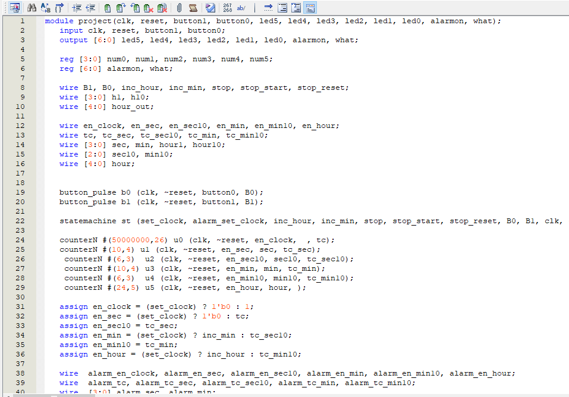

# 디지털시계

개요: Synaptic CAD의 Verilogger로 개발, Altera사의 DE2-115보드를 통해 디지털 시계를 구현했다. 

기능 : 디지털시계, 스톱워치, 알람

## 동작설명

### 1. 디지털 시계 기능

<kbd></kbd>

기본적으로 시 분 초를 나타내준다. 

### 2. 알람 시간 설정

<kbd></kbd>

알람 시간 설정은 위와 같이 나타낸다. 7 segment LED의 hex0 부분에 A표시를 넣어 사용자에게 알람 설정 중이라는 것을 표시해준다.

### 3. 알람 동작

<kbd></kbd>

알람 동작은 7 segment LED의 hex1 부분에 A표시를 넣어 사용자에게 알람이 울린다는 것을 알려준다. always 문을 사용하여 디지털시계와 알람 설정 시간의 시간과 분이 일치하면 표시되게 구현,
알람이 한번 발생하면 1분 동안 지속이 된다.

## 구성

<kbd></kbd>
총 6개의 모듈로 나눠져 있다. 

상태도

<kbd></kbd>

상태도처럼 동작하도록 구성이 되어있다.

### 1. counterN.v

<kbd></kbd>

modulo-N 카운터 모듈이다. 1초 단위부터 각 시간 분 초에 필요한 카운터들을 생성해준다.

### 2.button_pulse.v

<kbd></kbd>

button_pulse 모듈이다. button이 눌린 동안 button 입력이 여러 clock 지속할 경우에도 1번의 button 입력이 들어온 것으로 처리하기 위함이다.

<kbd></kbd>

button 입력을 1clock 폭을 갖는 pulse로 변환해준다.

나는 보드의 button을 사용하지 않고, Slide Switch를 사용하긴 했다. 그래도 위와 같은 변환과정이 없었을 때 스위치를 빠르게 올리지 않을 경우 많은 입력이 발생하는 것을 확인했었다.

<kbd>kbd>

버튼 입력에 대해 나오는 출력을 통해 동작에 대한 상태 변화를 해준다.

### 4. led.v

<kbd>kbd>

7-segment LED에 입력된 데이터값에 따라 보이는 LED의 상태를 나눴다.

<kbd>kbd>

모듈로 24카운터를 사용한 값을 10의 자리와 1의 자리로 나눠주며, 값이 10 미만일 경우 10의 자리 수를 7-segment LED 에서 나타내지 않기 위해 DEFAULT로 만들어준다.

### 6. project.v

<kbd>kbd>

앞에 설명한 모듈을 이용한 프로젝트 모듈이다. 이 프로젝트 모듈 안을 살펴보자.

- clock

<kbd></kbd>

1초 clock은 sec의 enable 신호를 발생시키고, sec은 sec10의 enable 신호를, sec10은 min을, min은 min10, min10은 hour의 enable 신호를 발생 시켜 동작하게 한다.

<kbd>kbd>

- 디지털시계

<kbd>kbd>

50000000 모듈러 카운터를 사용하여 1초 단위를 구성했다.
statemachine 에서 나온 set_clock 신호를 통해 신호를 받게 되면, 카운터의 enable 신호에 0을 주게 하여 clock에 따라 카운트가 되는 동작을 멈추게 했다.

 버튼b0과 b1의 입력을 통해 Statemachine 에서 나온 값을 이용하여 시간을 설정하는 기능과 디지털시계 레지스터 안에 값들을 넣는 동작을 해준다.

- 스톱워치

    <kbd></kbd>

디지털시계에는 오천만 클럭이 발생했을 경우를 이용해 1초를 구현했지만, 이번에는 모듈로 오십만 카운터를 사용하여 0.01초를 만들고 나머지는 디지털시계와 같이 만들었다.

살짝 다른 점이 있다면, 디지털시계의 시간 부분은 모듈로24 카운터를 사용한 뒤 converter를 실행 시켜 십의 자리와 일의 자리를 나눈 뒤 10보다 작으면 10의 자릿수를 표시하지 않았는데, 스톱워치는 그럴 필요가 없어서 분 단위를 모듈로 6카운터와 모듈로 10카운터를 사용하여 만들었다.

- 알람

<kbd>kbd>

모듈로 10 카운터, 모듈로 6카운터를 이용하여 분을 설정하고 모듈로 24카운터를 사용하여 시간을 설정했다. 사진에는 없지만, 위에 각각의 레지스터 공간들을 사전에 넣어 놨었는데 그 안에 statemachine 버튼 입력값을 통해 저장될 값들을 넣어준다.

- 상태변화

    <kbd></kbd>

Always문을 사용하여 시계의 동작이 알람 설정, 스톱워치, 디지털시계 일 때 각각 어떤 7bit 값들이 num0~num5 레지스트에 추가될지를 설정해준다.

중간에 보이는 what은 알람 시간 설정 상태임을 확인하기 위해 hex0에 추가한 7-segment 값이다.

- LED, 알람 구현

<kbd>kbd>

위에는 저장된 num0~num5 를 LED module 에 넣어주는 것이고 아래는 always문을 이용한 알람 동작 소스다.

모듈로 24카운트를 사용해 저장된 값의 비교를 통해 알람을 구현했다.

디지털시계의 hour와 알람에 있는 hour가 같고, 디지털시계의 분의 십의 자리와 알람의 분의 십의 자릿수가 같고, 디지털시계의 분의 일의 자리 수 알람의 분의 일의 자릿수가 같을 때

alarmon의 값을 변경 시켜 알람이 동작함을 사용자에게 확인해준다.
